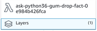
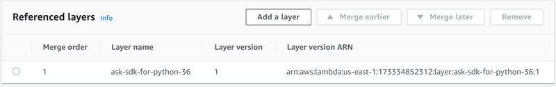

# How to Use AWS Lambda Layers with Alexa Skills

## What are AWS Lambda Layers?

You can check out the documentation [here](https://docs.aws.amazon.com/lambda/latest/dg/configuration-layers.html), however the key concept is that you can use libraries in your function without needing to include them in your deployment package.  This lets you keep your deployment package small.

## How do I get my skill to use a layer?

You can build your own layer, or use a public layer.  The ASK SDK can be found in the layers described [here](../../resources/lambda-layers/ask-sdk-lambda-layers.md).

If you use one of the ASK sample skills found in the Serverless Application Repository published by "Alexa Skills Kit", it will use layers, so once you deploy the application you're all set!

If you want add a layer to your existing skill, navigate to the function in the AWS Lambda Console.  Once you are there, look for the Layers button directly below the Function button in the Designer.

Click on the Layers button will bring up the Referenced Layers section:

From here you can add, remove or rearrange the layers.

To add a new layer, click **Add a layer**, select the option to **Provide a layer version ARN** and paste the ARN for the layer you want to use.  Be sure to use a layer compatible with your Lambda function's runtime.  Click [here](../../resources/lambda-layers/ask-sdk-lambda-layers.md) to see the list of the ASK SDK layers.  Click **Add** and once you're back on your function page, be sure to click **Save**!

\###